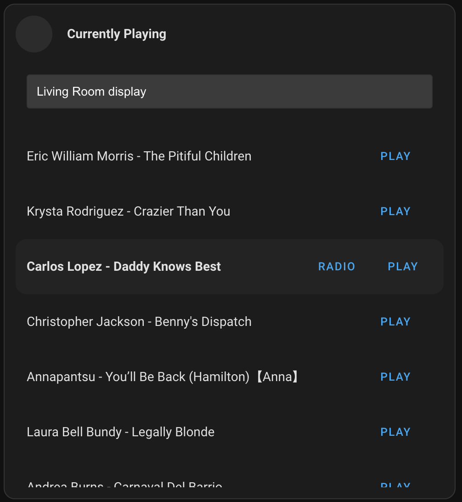
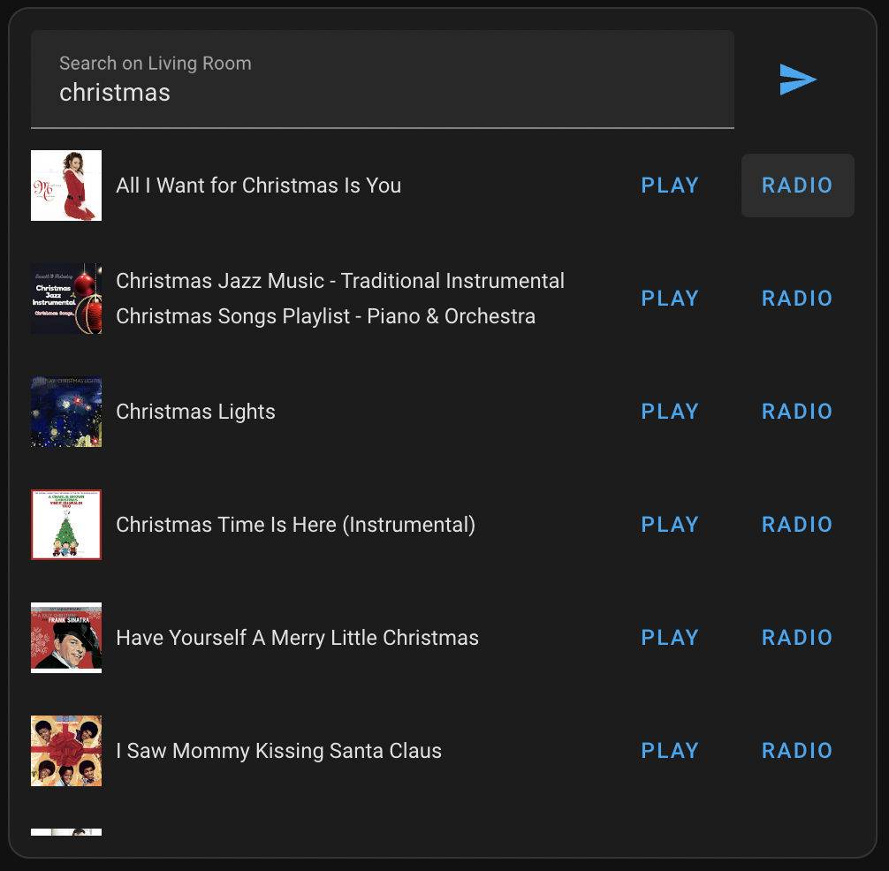

# PoLR-YTube-Media-Card

A collection of cards was design to enhance the features of the [YTube_Media_Player integration](https://github.com/KoljaWindeler/ytube_music_player) and the [Mini Media Player](https://github.com/kalkih/mini-media-player)

[Demo](https://github.com/pathofleastresistor/polr-ytube-media-card/assets/91756648/3fae5ef4-8dcd-40c5-83d7-f7c5862f9b32)


## Installation

### HACS

1. Open the HACS section of Home Assistant.
2. Click the "..." button in the top right corner and select "Custom Repositories."
3. In the window that opens paste this Github URL (https://github.com/pathofleastresistor/polr-ytube-media-card).
4. Select "Lovelace"
5. In the window that opens when you select it click om "Install This Repository in HACS"

### Manually

1. Copy `polr-ytube-media-card.js` into your `<config>/<www>` folder
2. Add `polr-ytube-media-card.js` as a dashboard resource.

## PoLR-YTube-Playing-Card

Get the full experience of the ytube_music_player component! You can see what's currently playing, browse through suggestions, search, and access your library!

### Settings

-   `entity_id` - a YTube_Media_Player entity
-   `showHeader` - `true`/`false` to show the header
-   `header` - title of the card

### Example

```
type: custom:polr-ytube-playing-card
entity_id: media_player.youtube_living_room_display
header: YouTube Music
showHeader: true
```



## PoLR-YTube-Search-Card

If you just want a search bar, then use `polr-ytube-search-card` to get the search functionality without the rest of the card experience.

### Settings

-   `entity_id` - a YTube_Media_Player entity
-   `showHeader` - `true`/`false` to show the header
-   `header` - title of the card

### Example

```
type: custom:polr-ytube-search-card
icon: mdi:card-search
entity_id: media_player.youtube_living_room_display
header: Living Room (YouTube)
searchTitle: Search on Living Room
```


